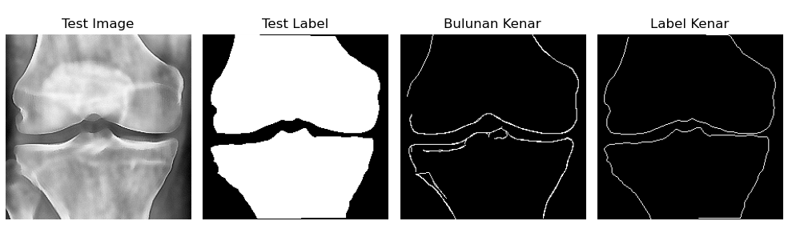
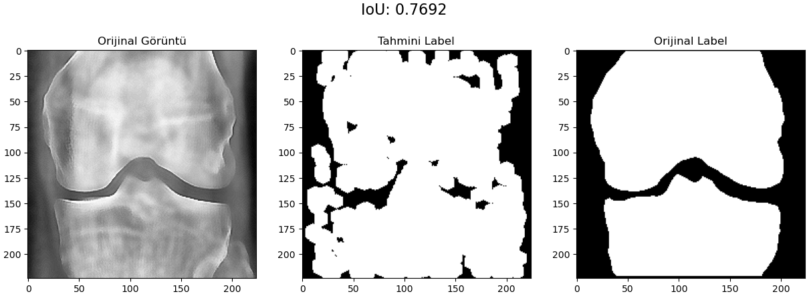
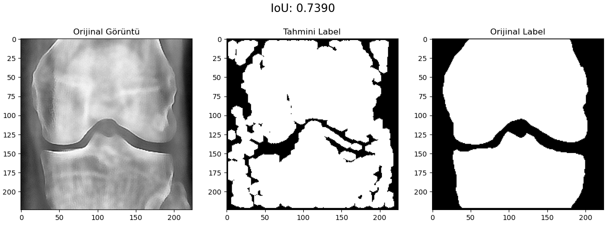

# Kemik Röntgen Görüntülerinde Kireçlenme Tespiti (Klasik Görüntü İşleme)

Bu çalışma, **yapay zeka/öğrenme kullanmadan**, yalnızca **klasik görüntü işleme** adımlarıyla kemik röntgen (X-ray) görüntülerindeki **kireçlenme** (osteofit vb.) bulgularını vurgulamayı amaçlar. Yaklaşım; kontrast ve gürültü kontrolüyle başlayan, kenar ve desen temelli temsil çıkarımıyla devam eden ve çok ölçekli incelemeyle güçlendirilen bir boru hattı içerir. Aday bölgelerin tutarlılığını değerlendirmek için **anahtar nokta eşleştirme** (özellik tanımlayıcıları üzerinden karşılaştırma) kullanılmış, böylece hatalı pozitifler azaltılmaya çalışılmıştır.

## Yöntem Özeti
- **Ön-işleme:** Görüntü kontrastını artırma (örn. CLAHE), gürültü azaltma (Gaussian/median) ve ton/aydınlık normalizasyonu ile kemik yapıları belirginleştirildi.  
- **Desen Kodlama (Texture/Pattern):** Ön-işleme sonrasında yerel doku/desen özellikleri kodlanarak kemik kenarındaki düzensiz çıkıntılara duyarlı basit kural kümeleri oluşturuldu.  
- **Kenar Deseni & Kenar Çıkartımı:** Eşikleme + morfolojik işlemler ve Canny/Sobel gibi klasik kenar bulucularla kemik sınırları ve olası kireçlenme çıkıntıları ayrıştırıldı; kenar yoğunluğu ve geometri ölçüleri yorumlandı.  
- **Gauss Piramidi ile Çok Ölçekli İnceleme:** Farklı çözünürlük seviyelerinde (Gaussian Pyramid) aynı desen/kenar işlemleri tekrarlanarak küçük-büyük ölçekli bulguların tutarlı biçimde yakalanması hedeflendi.  
- **Anahtar Nokta Eşleştirme:** Aday bölgeler arasında **özellik tanımlayıcı temelli** eşleştirme yapılarak (ör. ORB/SIFT/AKAZE benzeri yaklaşım) ölçek/kontrast değişimlerine karşı dayanıklılık sağlandı ve eşleşme tutarlılığı düşük alanlar elendi.

> Not: Bu proje **araştırma/öğrenme** amaçlıdır; klinik karar desteği yerine geçmez.

## Örnek Çıktılar
Aşağıdaki yer tutucuları kendi görsellerinle değiştir (dosyaları `media/` klasörüne koy):

  

    
  

  

    
  

  

    
  

  

    
  

